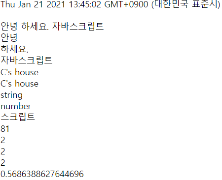

# js210121

정적인 페이지 : html, css

동적인 페이지 : javascript(객체 기반(클라이언트 스크립트)언어, 동작을 클라이언트에서 함, 확장자 js), php, jsp, asp등(서버스크립트언어, 동작을 서버에서함)

생성된(from클래스) 객체를 이용하여 동적인 페이지를 기술하는 언어

클래스 -> 객체생성(속성 초기화) -> 객체 동작...

붕어빵기계 -> 붕어빵(크리:5cm,내용물:팥,..)  -> 붕어삥 굽는다

자동차 공장 -> 자동차(색상:빨강,배기량:3000,...) -> 달린다, 멈춘다...

## HTML안에서 JS하기

```
<!DOCTYPE html>
<html lang="en">
<head>
    <meta charset="UTF-8">
    <title>Title</title>
    <script type="text/javascript">
        document.write("hello");        #객체.동작(내용);
    </script>
</head>
<body>
</body>
</html>
```

## 변수

```
<html lang="en">
<head>
    <meta charset="UTF-8">
    <script type="text/javascript">
        var a=10;                        #var=variable, a라는 변수에 10 대입해라
        var b='k';
        document.write(a);
        document.write(b);
        
        function myfunc(){				#함수 정의
            return 3;
        }
        ret=myfunc();					#함수 호출
        document.write(ret);
    </script>
</head>
<body>
</body>
</html>
```


## 자바스크립트 자료 유형

Boolean : 참 또는 거짓

String : 문자열

Number : 숫자형

null : 빈 값

NaN : Not a Number, 숫자아님


## JS기초

```
<html lang="en">
<head>
    <meta charset="UTF-8">
    <script type="text/javascript">
        var a=10;
        var b='k';
        var c=0.5;
        var d=-4.2;
        var e=0x1af;
        var f=01;
        document.write(a);
        document.write(b);
        document.write(c);
        document.write(d);
        document.write(e);
        document.write(f);
    </script>
</head>
<body>
</body>
</html>
```

## JS

```
<html lang="en">
<head>
    <meta charset="UTF-8">
    <script type="text/javascript">
        var a=10;
        var b='k';
        var c=0.5;
        var d=-4.2;
        var e=0x1af; //16진수(ox)
        var f=01;  //8진수(0)
        var k='5';
        document.write(a); 		    	//10
        document.write(b); 		    	//k
        document.write(c); 		    	//0.5
        document.write(d);          	 //-4.2
        document.write(e);			    //431
        document.write(f);			    //1
        document.write(k+2);  			//k를 5라고 저장했는데 52가 나옴
        document.write(parseInt(k)+2);  //7, parseInt() : 문자로된 숫자를 숫자로 변환 "5"->5
        document.write(Math.sqrt(16));  //4, square root(제곱근):9의 제곱근은3
        document.write(3/0);            // Infinity
    </script>
</head>
<body>
</body>
</html>
```

## 다시

```
<html lang="en">
<head>
    <meta charset="UTF-8">
    <title>Title</title>
</head>
<body>
<script>
    alert('Hello world')
    alert(1+2);
    alert(1.5+2.4);
</script>
</body>
</html>
```

```
<body>
    <script>
        //클래스 (대문자로 시작) -> 객체 -> 객체 -> 객체.함수()
        //Math클래스에 있는 pow함수를 호출하는데 3과 4를 전달해라
        document.write(Math.pow(3,4)+'<br/>');  //power:제곱함수
        document.write(Math.round(1.7)+'<br/>');  //round 반올림
        document.write(Math.ceil(1.2)+'<br/>');  //ceil 올림
        document.write(Math.floor(2.9)+'<br/>');  //floor 내림
    </script>
</body>
</html>
```

```
<script>
    document.write(new Date()+'<br/>'); //클래스 --new--> 객체 생성

  //var a=1;   alert(a+1); //좋지는 않지만 ; 이용하면 한 줄에 많은 문장 가능
  //alert("안녕".length) //문자열 길이
  //alert("안녕\n하세요.\n자바스크립트");  //띄어쓰기로 나옴

    document.write("안녕\n하세요.\n자바스크립트"+'<br/>');  //한 줄로 나옴
    document.write("안녕<br/>하세요.<br/>자바스크립트"+'<br/>');  //개행으로 나옴

    document.write("C's house"+'<br/>');  //나옴
  //document.write('C's house'+'<br/>');  //안나옴
    document.write('C\'s house'+'<br/>');  //나옴

    document.write(typeof "1"+'<br/>');  //string
    document.write(typeof 1+'<br/>');  //number

    document.write('스크립트'+'<br/>');  //정상
  //document.write("스크립트'+'<br/>');  //비정상

    //클래스 (대문자로 시작) -> 객체 -> 객체 -> 객체.함수()
    //Math클래스에 있는 pow함수를 호출하는데 3과 4를 전달해라
    document.write(Math.pow(3,4)+'<br/>');  //power:제곱함수
    document.write(Math.round(1.7)+'<br/>');  //round 반올림
    document.write(Math.ceil(1.2)+'<br/>');  //ceil 올림
    document.write(Math.floor(2.9)+'<br/>');  //floor 내림
    document.write(Math.random()+'<br/>');  //random:0~1 난수
</script>
```



```
    <script>
        document.write("one"!="two");//true
        document.write("one"=="two");//false
        document.write(1!=1);        //false
        document.write(1!=2);        //true

      //document.write(true==1);     // true java에서는 true와 1이 같다
      //document.write(true=="1");   // true 문자건 숫자건 1은 true
      //document.write(true==0);     // false
      //document.write(true=="0");   // false
      //document.write(true==2);     // false
      //document.write(true=="2");   // false


      //alert("1"==1); // true내부적으로 (비교)연산을 하기 전에 자동으로 형변환 (1->"1")
      //alert("1"===1); // === 으로 비교하면 false 나옴
    </script>
```

## 조건

```
<body>
    <script>
      /*if(조건{
        수행할 문장;
        }*/

      /*if(true){
        alert("1");
        alert("2");
        }*/

      /*if(false){
        alert(1);
        }
        else{
        alert(2);
        }*/

      /*if(false){
        alert(1);
        }
        else if(false){
        alert(2);
        }
        else{
        alert(3);
        }*/
    </script>
</body>
```

```
<body>
    <script>
            id=prompt("아이디:");
            if(id=='master'){
            pass=prompt("비밀번호:");
                if(pass==1234){
                alert("인증에 성공하였습니다.");
                }
                else{
                alert("인증에 실패하였습니다.");
                }
            }
            else{
            alert("아이디가 일치하지 않습니다.");
            }
    </script>
</body>
```

