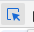
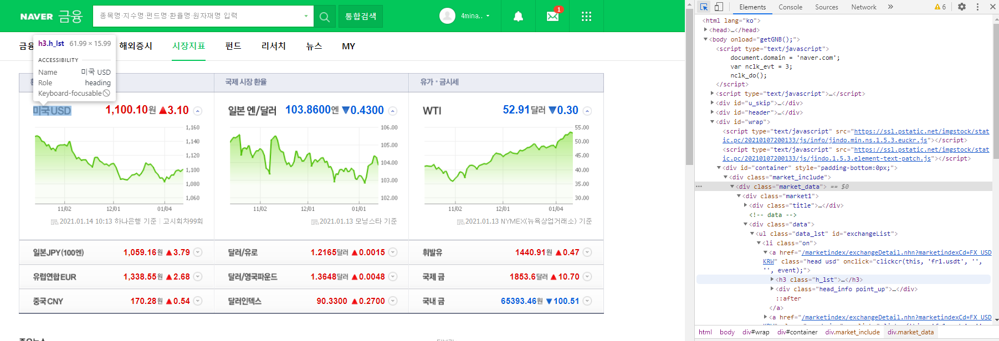
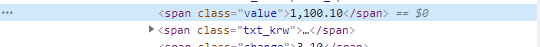
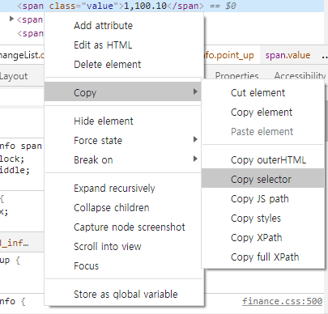

# web.3_21.01.14

## 실습


## ID를 이용한 데이토 참조 방법

```
<ul id='language'>
    <li id="ja">java</li>
    <li id="cp">cpp</li>
    <li id="py">python</li>
    <li id="sp">spark</li>
    <li id="js">javascript</li>
</ul>
```

```
from  bs4 import BeautifulSoup
fp=open("lang.html",mode="r", encoding="utf-8"(((한글 있을 때는 인코딩))))
soup=BeautifulSoup(fp, "html.parser")
print(soup)
print(soup.select_one("ul>li"))
print(soup.select_one("ul>li#py"))			    # ul 안에서 유일할 때
print(soup.select_one("#py"))                   # 전체에서 유일할 떄
print(soup.select_one("ul#language > li#py"))   # 조금 비효율적인 방법
print(soup.select_one("#language > #py"))	    # id만 가지고 타고 들어가기
print(soup.select_one("#language #py"))			# > 대신 띄어쓰기도 가능
print(soup.select_one("li[id='py']"))			# 요런것도 있고

<li id="ja">java</li>
<li id="py">python</li>
<li id="py">python</li>
```

```
print(soup.select_one("li:nth-of-type(1)"))
print(soup.select_one("li:nth-of-type(2)"))
print(soup.select_one("li:nth-of-type(3)"))
<li id="ja">java</li>
<li id="cp">cpp</li>
<li id="py">python</li>
```


## 네이버 환율정보

```
from  bs4 import BeautifulSoup
import urllib.request as req           #url가져올 때 임폴트 해줘야 함
url="https://finance.naver.com/marketindex/?tabSel=exchange#tab_section"
res=req.urlopen(url).read().decode('euc-kr')
soup=BeautifulSoup(res, "html.parser")
```

 <**a** href="[/marketindex/exchangeDetail.nhn?marketindexCd=FX_USDKRW](https://finance.naver.com/marketindex/exchangeDetail.nhn?marketindexCd=FX_USDKRW)" **class="head usd"** onClick="clickcr(this, 'fr1.usdt', '', '', event);"><h3 class="h_lst"><span class="blind">미국 USD</span></h3>   

이거 표현할 떄는 a.head.used 로 해야함

```
print("달러당",soup.select("a.head.usd>div>span.value")[0].string,"원")
달러당 1,098.90 원
```


약간 더 세련된 방법으로는

이거 누른다음에 찾고자 하는 부분으로 이동



해당 부분이 선택됨


복사 셀렉터 선택


```
print("달러당",soup.select_one("#exchangeList > li:nth-child(1) > a.head.usd > div > span.value").string,"원")
달러당 1,099.70 원
```


## 위키 가져오기

```
import urllib.request as req           #url가져올 때 임폴트 해줘야 함
url="https://ko.wikisource.org/wiki/%EC%A0%80%EC%9E%90:%EC%9C%A4%EB%8F%99%EC%A3%BC"  #url주소 복붙
res=req.urlopen(url).read().decode('euc-kr')                      # url 읽어주기 깨짐 방지
soup=BeautifulSoup(res, "html.parser")    # 수프
print("시집 :",soup.select_one("#mw-content-text > div.mw-parser-output > ul:nth-child(6) > li > b > a").string)
```

```
mylist=soup.select("#mw-content-text > div.mw-parser-output > ul:nth-child(6) > li > ul > li")
for li in mylist:
    print(li.string)
서시
자화상
소년
눈 오는 지도
돌아와 보는 밤
병원
새로운 길
간판 없는 거리
태초의 아침
또 태초의 아침
새벽이 올 때까지
무서운 시간
십자가
바람이 불어
슬픈 족속
눈감고 간다
또 다른 고향
길
별 헤는 밤
```


## css선택자

```
fp=open("fruits-vegetables.html", encoding="utf-8")
soup=BeautifulSoup(fp, "html.parser")
print(soup.select("div > h1"))          		#직접 찾아가기
# print(soup.select("div > ul#fr-list"))		#아이디 찾아가기
print(soup.select("li.black"))                  #클래스를 나타낼 때는 (.) 사용!!!!@#!#!@!@@#
```

```
print(soup.select("li"))
print(soup.select("li.black"))
print(soup.select("li.black")[1])
print(soup.select("li.black")[1].string)  

[<li class="red green" data-lo="ko">사과</li>, <li class="purple" data-lo="us">포도</li>, <li class="yellow" data-lo="us">레몬</li>, <li class="yellow" data-lo="ko">오렌지</li>, <li class="white green" data-lo="ko">무</li>, <li class="red green" data-lo="us">파프리카</li>, <li class="black" data-lo="ko">가지</li>, <li class="black" data-lo="us">아보카도</li>, <li class="white" data-lo="cn">연근</li>]

[<li class="black" data-lo="ko">가지</li>, <li class="black" data-lo="us">아보카도</li>]

<li class="black" data-lo="us">아보카도</li>

아보카도
```

```
print(soup.select("#ve-list"))
print(soup.select("#ve-list > li"))
print(soup.select("#ve-list > li:nth-of-type(4)")[0].string)

[<ul id="ve-list">
<li class="white green" data-lo="ko">무</li>
<li class="red green" data-lo="us">파프리카</li>
<li class="black" data-lo="ko">가지</li>
<li class="black" data-lo="us">아보카도</li>
<li class="white" data-lo="cn">연근</li>
</ul>]

[<li class="white green" data-lo="ko">무</li>, <li class="red green" data-lo="us">파프리카</li>, <li class="black" data-lo="ko">가지</li>, <li class="black" data-lo="us">아보카도</li>, <li class="white" data-lo="cn">연근</li>]

아보카도
```

```
print(soup.select("#ve-list > li.black")[0].string)
가지
```

```
# print(soup.select("#ve-list > li[data-lo='us']")[1])  
<li class="black" data-lo="us">아보카도</li>
```

```
fp=open("fruits-vegetables.html", encoding="utf-8")
soup=BeautifulSoup(fp, "html.parser")
dic={"data-lo":"us"}#속성명:속성값
print(soup.findAll("li", dic)) # find 함수 == select_one함수, findALL==select함수
```

```
dic={"data-lo":"us"}
print(soup.findAll("li", dic))
[<li class="purple" data-lo="us">포도</li>, <li class="yellow" data-lo="us">레몬</li>, <li class="red green" data-lo="us">파프리카</li>, <li class="black" data-lo="us">아보카도</li>]


dic={"data-lo":"us","class":"black"}
print(soup.findAll("li", dic))
[<li class="black" data-lo="us">아보카도</li>]
```

```
print(soup.find(id="ve-list").find("li",dic))
<li class="black" data-lo="us">아보카도</li>
```

## 셀레니움

```
from selenium import webdriver                              #셀레니움에 있는 웹드라이버 모듈 임포트
driver=webdriver.Chrome("c:/scrap/chromedriver.exe")        #크롭드라이버 다운받은거 왜하는지는 모름
url="https:www.naver.com"                                   #url설정
driver.get(url)                                             #url열어
html=driver.page_source                                     #url연곳에서 소스코드를 html에 저장
print(html)                                                 #출력해
```


## 멜론 해보기

```
from selenium import webdriver                              
driver=webdriver.Chrome("c:/scrap/chromedriver.exe")        
url="https://www.melon.com/chart/index.htm"						    #들어가고 싶은 url주소 입력
driver.get(url)														#이 url페이지를 제어할거임
html=driver.page_source                                             #url들어가서 소스코드좀 나한테 줘
soup=(BeautifulSoup(html, "html.parser"))							#소스코드 가져온거 내가 조작할거야
songs=soup.select("tr")[1:]                                      	#tr이 테이블 한 줄 개념인데 첫번째 줄부터 끝까지 소스코드 저장
print(songs[0])														#그거 뽑아봐
```


## 강아지 고양이

```
from bs4 import BeautifulSoup
from urllib.request import urlopen
from urllib.parse import quote_plus


baseUrl="https://search.naver.com/search.naver?where=image&sm=tab_jum&query="
word=input("검색어를 입력하세요 :")
num=int(input("개수 입력 :"))


url=baseUrl+quote_plus(word)
html=urlopen(url)
soup=BeautifulSoup(html, "html.parser")
print(soup)
```


