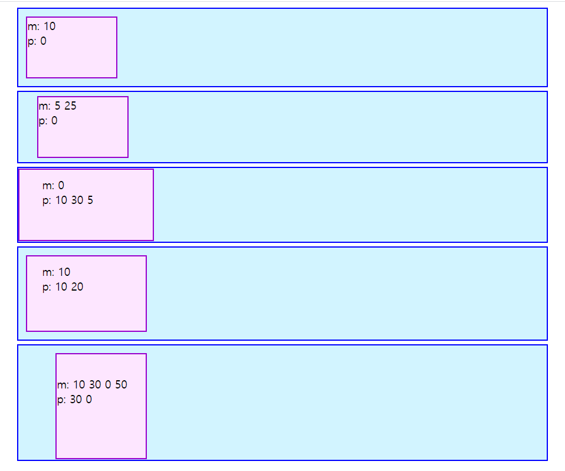
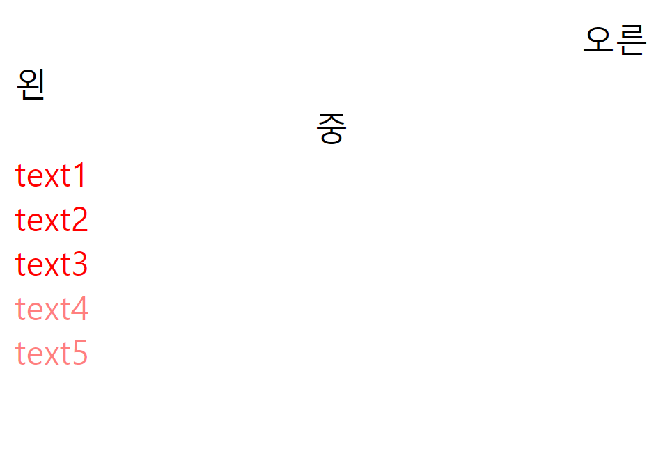
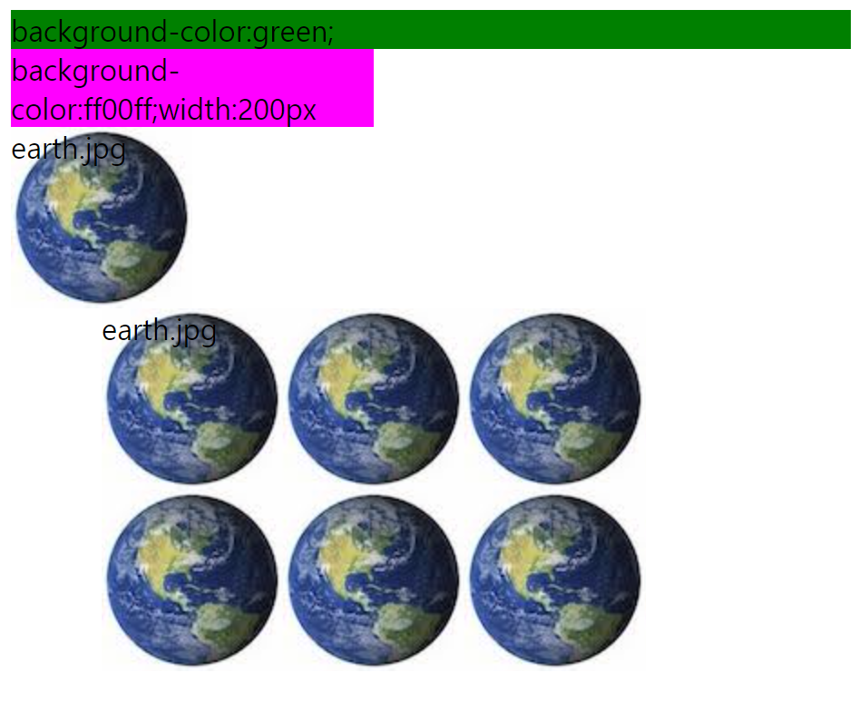
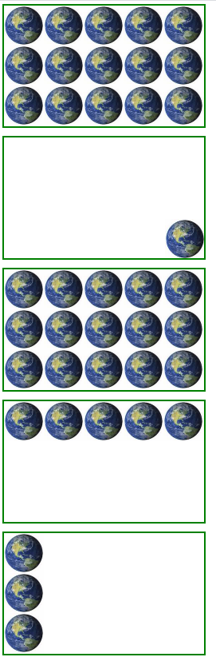
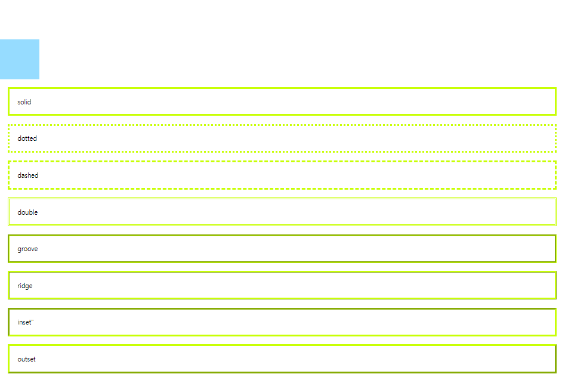
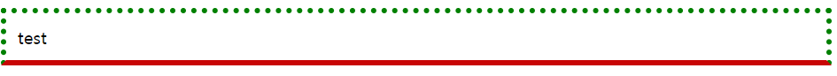
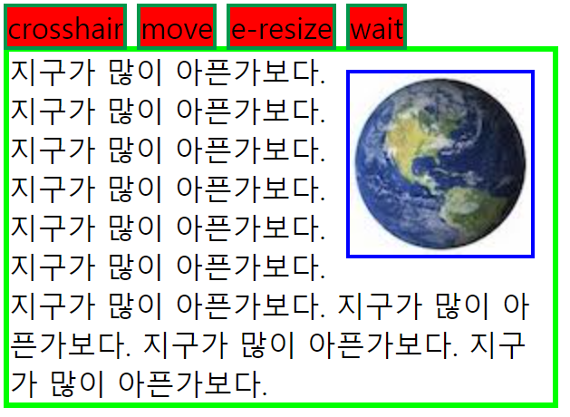

# css2

```
<html>
<head>
    <meta charset="UTF-8">
    <style>
        .box{
        background-color:#09c;
        }
        .hover-box:hover{
         background-color:orange;
        }
        .focus-input:focus{
        background:yellow;
        }
    </style>
</head>
<body>
<div class="box hover-box">마우스를 올려주세요</div>
<input type="text" value="click me" class="focus-input">
</body>
</html>
```

### 마진 패딩

* 마진 바깥쪽(상하좌우) 여백 패딩은 안쪽
* margin:100px                                       상하좌우 여백
* margin:50px 10px                               상하50px, 좌우10px
* margin:10px 20px 30px 40px            상10하20좌30우40px
* margin:10px 20px 30px                     상10하20좌30우30px

```
<html>
<head>
    <meta charset="UTF-8">
    <style>
   .box-container{
      background-color: #d2f4ff;
      border: 2px solid #09c;
      margin: 5px 15px;
   }
   .box-container div{
      width: 120px;
      height: 80px;
      background-color: #fde6ff;
      border: 2px solid #90C;
      font-size: 15px;
   }
   #box1{ margin: 10px;  padding: 0; }
   #box2{ margin: 5px 25px; padding: 0; }
   #box3{ margin: 0;  padding: 10px 30px 5px; }
   #box4{ margin: 10px; padding: 10px 20px; }
   #box5{ margin: 10px 30px 0 50px; padding: 30px 0 }    </style>
</head>
<body>
   <div class="box-container">
      <div id="box1">m: 10<br>p: 0</div>
   </div>
   <div class="box-container">
      <div id="box2">m: 5 25<br>p: 0</div>
   </div>
   <div class="box-container">
      <div id="box3">m: 0<br>p: 10 30 5</div>
   </div>
   <div class="box-container">
      <div id="box4">m: 10<br>p: 10 20</div>
   </div>
   <div class="box-container">
      <div id="box5">m: 10 30 0 50<br>p: 30 0</div>
   </div>
</body>
</html>
```




### 폰트

```
<html>
<head>
    <meta charset="UTF-8">
    <style>
        #text1{font-size:40px}
        #text2{font-size:30px}
        #text3{font-size:20px}
        #text4{font: italic bold 50px serif;}
        .bold{font-weight:bold}
        .italic{font-style:italic}
        .jinji{font-family:"궁서"}
        .peonji{font-family:"휴먼편지체"}
    </style>
</head>
<body>
    <div id="text1">40픽셀</div>
    <div id="text2">30픽셀</div>
    <div id="text3">20픽셀</div>
    <div id="text4">한방에 적용</div>
    <div class="bold">굵은</div>
    <div class="italic">이탤릭</div>
    <div class="jinji">궁서</div>
    <div class="peonji">휴먼편지체</div>
</body>
</html>
```


### RGB투명 설정

```
<html>
<head>
    <meta charset="UTF-8">
    <style>
        #align1{text-align:right;}
        #align2{text-align:left;}
        #align3{text-align:center;}
    </style>
</head>
<body>
    <div id="align1">오른</div>
    <div id="align2">왼</div>
    <div id="align3">중</div>
    <div style="color:red">text1</div>
    <div style="color:ff0000">text2</div>
    <div style="color:f00">text3</div>
    <div style="color:rgb(255,0,0)">text4</div>
    <div style="color:rgba(255,0,0,0.5)">text5</div> #a는 불투명도 
</body>
</html>
```



### 배경화면주기

```
<html>
<head>
    <meta charset="UTF-8">
    <style>
        #box1-1{background-color:green;}
        #box1-2{background-color:ff00ff;width:200px}
        #box2-1{
        width:100px;
        height:100px;
        background-image:url("earth.jpg");
        }
        #box2-2{
        margin:0 0 50 50;
        width:300px;
        height:200px;
        background-image:url("earth.jpg");
        }
    </style>
</head>
<body>
    <div id="box1-1">background-color:green;</div>
    <div id="box1-2">background-color:ff00ff;width:200px</div>
    <div id="box2-1">earth.jpg</div>
    <div id="box2-2">earth.jpg</div>
</body>
</html>
```



### 배경 이미지

```
<html>
<head>
    <meta charset="UTF-8">
    <style>
        .abox{
        width:500px;
        height:300px;
        background-image:url("earth.jpg");
        margin:0 0 20px 0;
        border:5px solid green
        }
        #box1{
        background-repeat:no-repeat;
        background-position:right bottom;
        }
        #box2{background-repeat:repeat}
        #box3{background-repeat:repeat-x}
        #box4{background-repeat:repeat-y}
    </style>
</head>
<body>
    <div class="abox"></div>
    <div class="abox" id="box1"></div>
    <div class="abox" id="box2"></div>
    <div class="abox" id="box3"></div>
    <div class="abox" id="box4"></div>
</body>
</html>
```



### 태두리

```
<html>
<head>
    <meta charset="UTF-8">
    <style>
        .border-style > p{
        margin:20px;
        padding:20px;
        border-color:rgb(200,255,5);
        border-width:5px;
        }
        .box{
        width:100px;
        height:100px;
        background-color:rgb(150,220,255);
        }
        #boxh{visibility:hidden}
        #boxv{visibility:visible}
    </style>
</head>
<body>
    <div class="box" id="boxh">

    </div>
    <div class="box" id="boxv">

    </div>

    <div class="border-style">
        <p style="border-style:solid">solid</p>
        <p style="border-style:dotted">dotted</p>
        <p style="border-style:dashed">dashed</p>
        <p style="border-style:double">double</p>
        <p style="border-style:groove">groove</p>
        <p style="border-style:ridge">ridge</p>
        <p style="border-style:inset">inset"</p>
        <p style="border-style:outset">outset</p>
    </div>
</body>
</html>
```



### 해보기

```
<html>
<head>
    <meta charset="UTF-8">
    <style>
        #box{
        mafgin:0px;
        padding:10px;
        border:5px dotted green;
        border-bottom:solid rgb(200,5,5) 5px;
        }
    </style>
</head>
<body>
    <div id="box">test</div>
</body>
</html>
```



### 커서랑 지구아픈가보다

```
<html>
<head>
    <meta charset="UTF-8">
    <style>
        .float-container{
        width:300px;
        border:3px solid #0f0;
        }

        .float-container img{
        float:right;
        margin:10px;
        padding:0px;
        border:2px solid rgb(0,0,255);
        }

        .cursors span{
        background-color: rgb(255,0,0);
        border:2px solid rgb(0,150,75);
        }
    </style>
</head>
<body>
     <div class="cursors">
         <span style="cursor:crosshair">crosshair</span>
         <span style="cursor:move">move</span>
         <span style="cursor:e-resize">e-resize</span>
         <span style="cursor:wait">wait</span>
    </div>
    <div class="float-container">
        
        지구가 많이 아픈가보다.
        지구가 많이 아픈가보다.
        지구가 많이 아픈가보다.
        지구가 많이 아픈가보다.
        지구가 많이 아픈가보다.
        지구가 많이 아픈가보다.
        지구가 많이 아픈가보다.
        지구가 많이 아픈가보다.
        지구가 많이 아픈가보다.
        지구가 많이 아픈가보다.
    </div>
</body>
</html>
```

