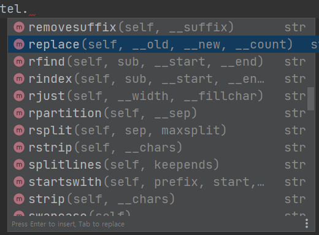
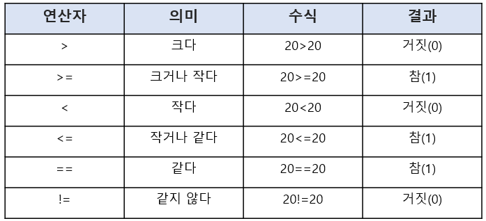
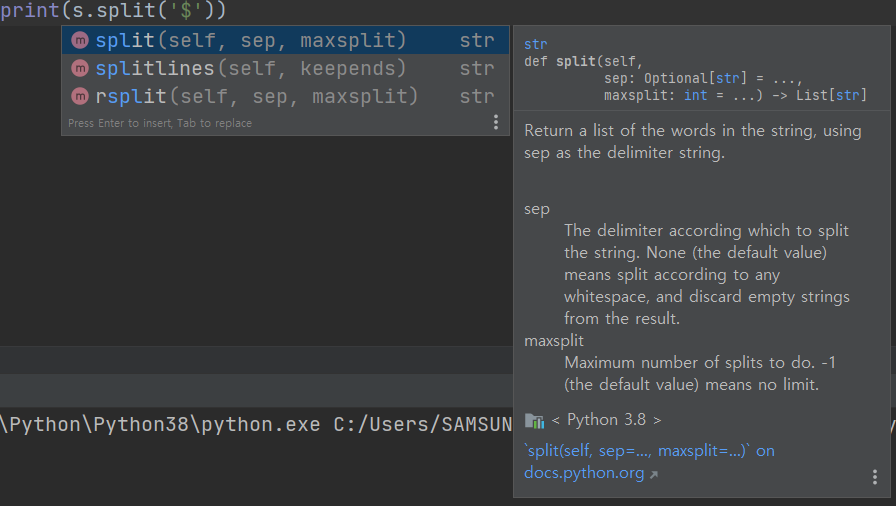

# 파이썬 Day 3


## 파이썬 실습


* offset 함수 : 몇 칸 건너뛸것인지, 양수(좌-->우), 음수(우-->좌)

  ```
  s='파이썬파이썬파이썬'
  print(s[::3])  #세 칸씩 건너뛴다
  
  # 파파파
  ```

  ```
  s='파이썬파이썬파이썬'
  print(s[::-1])           #d 우에서 좌로
  
  # 썬이파썬이파썬이파
  ```

  

* replace (~을, ~으로) : 문자열 치환

  데이터 수집 --> 전처리 --> 분석 --> ...  으로 이어지는 분석과정에서 내가 원하는 정보를 가져올 때 사용

  

  ex)

  자연어 처리 시 텍스트 데이터 수집

  대한민국, 한국, korea, Korea, SouthKorea 모두 다른의미를 가지고 있기에 replace 함수를 사용하여 같은 단어로 변환

  

                       # ctrl + spacebar : 목록창 나옴

  ```
  tel="010-1234-5678"
  print(tel.replace("-", ""))            # "-"를 ""로 바꿔라
  # 01012345678
  
  s = "Life is too short"
  print(s.replace("Life", "Your leg"))
  # Your leg is too short
  ```

  

* 불 연산자 (Boolean operator)  [관계 연산자, 논리 연산자]

* 관계 연산자

   
  
  숫자, 문자 모두 비교 가능
  
  ```
  print(3>2)
  # True
  ```
  
  ```
  print(2==2)
  # True
  ```
  
  ```
  print(3!=2)
  # True
  ```
  
  ```
  print('python'=='Python')
  # False
  ```
  
  ```
  a=1
  b=1
  print(a == b)   # (==) 는 두 값이 같읁를 비교
  # True
  
  print(a is b)   # (is) 는 두 객체(주소)가 동일하냐를 비교
  # True
  ```
  
  ```
  print(1 == 1.0)     # 정수와 실수라는 점에서 차이가 있지만, 값은 같다.
  # True
  
  print(1 is 1.0)     # (is) 는 두 객체가 같은지 비교. 1은 정수객체, 1.0은 실수객체
  # False         
  ```
  
  

* 논리 연산 : and, or, not

  and 모두 참 --> 참

  or 하나 이상 참 --> 참

  not 참 --> 거짓, 거짓 ==> 참
  
  ```
  print(True and True)
  True
  
  print(True and False)
  # False
  
  print(False and False)
  # False
  ```
  
  ```
  print(True or True)
  # True
  
  print(True or False)
  # True
  
  print(False or False)
  # False
  ```
  
  

* True, False

  0 : False

  1 (0이 아닌 수) : True

  

  빈 문자열(' ') : False

  문자열 : True

  ```
  print(bool(1))
  # True
  
  print(bool(0))
  # False
  
  print(bool(3.2))
  # True
  ```

  ```
  print(bool('test'))
  # True
  
  print(bool(''))
  # False
  
  print(bool(0 or 'test'))
  # True
  ```


* 포맷팅 정렬

  ```
  print("%10s" % "hi")    # 전체적으로 10자리를 확보하겠다. ( 공란 8 + 글자 2)
  #         hi
  ```

  ```
  print("hello%10s" % "hi")
  # hello        hi
  ```

  ```
  print("%-10shello" % "hi")           # 반대로 정렬
  # hi        hello
  ```

  ```
  print("{0}".format("hi"))
  #hi
  
  print("{0:<10}".format("hi"))  #10자리 확보 후 왼쪽 정렬
  # hi        
  
  print("{0:>10}".format("hi"))  #10자리 확보 후 오른쪽 정렬
  # 
  
  print("{0:^10}".format("hi"))  #10자리 확보 후 가운데 정렬
  #         hi
  
  print("{0:-^10}".format("hi"))
  # ----hi----
  ```

  

* 포맷팅 자릿수

  ```
  print("%.4f" % 3.141592)          # 소수 이하 5째 자리에서 반올림 --> 4째 자리까지 표현
  # 3.1416
  
  print("%10.4f" % 3.141592)        # 10자리를 확보한 다음 출력 (우측 맞춤)
  #    3.1416
  
  print("{0:10.4f}".format(3.141592))
  #     3.1416
  ```


* 포맷팅 기타

  ```
  num = 3
  s = "two"
  
  print(" I eat {0} apples".format(num))   # {0} 안의 값을 num으로 대체
  # I eat 3 apples
  
  print(" I eat {0} apples".format(s))   # {0} 안의 값을 s문자로 대체
  # I eat two apples
  ```

  ```
  num = 3
  s = "two"
  day = 'Three'
  
  print(" I ate {0} eggs. so I was sick for {1}days.".format(num, day))
  # I ate 3 eggs. so I was sick for Threedays.
  ```

  ```
  print(" I ate {num} eggs. so I was sick for {day}days.".format(num=5, day=2))            #이름으로도 대입할 수 있다
  # I ate 5 eggs. so I was sick for 2days.
  ```

  

* count 함수 : 몇개 있는지 세고자 할 때

  ```
  a = 'hello'
  print(a.count(''))
  # 6
  ```

  

* find 함수

  ```
  a = 'hello'
  print(a.find('l'))            # 여러개 있는 경우레는 맨 처음 나온 위치가 출력
  # 2
  
  print(a.find('x'))            # 찾고자 하는 문자가 없는 경우에는 -1이 나옴
  # -1
  
  print("apple pineapple".rfind('p'))
  # 12
  
  print("apple pineapple".rfind('pp'))
  # 11
  ```

  

* index 함수

  ```
  a = 'hello'
  print(a.index('l'))           # 위치를 찾을 때 사용
  # 2
  
  print(a.index('x'))           # find와 다른점은 없는 값을 찾을 때 error가 나옴
  # error
  
  print("apple pineapple".rindex('p'))
  # 12
  
  print("apple pineapple".rindex('pp'))
  # 11
  ```

  

* join 함수 ★★★

  ```
  print(",".join("abcd"))                 # 문자열에 특정 문자(기호)를 추가할 떄
  # a,b,c,d
  
  print(",".join(['a','b','c','d']))      # 리스트[]에 저장되어 있는 각각의 문자들이 (,)와 결함하여 하나의 문자열이 됨
  # a,b,c,d
  
  print("".join(['a','b','c','d']))       # ""를 사용하여 리스트를 문자열로 변환
  # abcd
  ```

  ​	

* upper % lower 함수 : 대소문자 변환

  ```
  a = "hi"
  print(a.upper())
  print(a.lower())
  # HI
    hi
  ```

  

* strip 함수

  ```
  n1 = "  대한민국"
  n2 = "대한민국  "
  n3 = "  대한민국  "
  print(n1.lstrip())
  print(n2.rstrip())
  print(n3.strip())
  # 대한민국
    대한민국
    대한민국
  ```


* split 함수 : (" ")문자 기준으로 문자열을 리스트로 분리

  ```
  print("안 녕 하 세 요".split())
  
  # ['안', '녕', '하', '세', '요']
  ```

  ```
  x1, x2 = map(int,input(" 숫자 두 개 입력 :").split(",")) # 컴마 문자로 입력데이터를 분리
  print(x1+x2)
  
  # 숫자 두 개 입력 :1,2
    3
  ```

  ```
  s = "Life$is$too$short"
  print(s.split('$'))
  
  # ['Life', 'is', 'too', 'short']
  ```


* 사전 검색

  


* 문자 바꾸기

  ```
  t= str.maketrans('aeiou', '12345')     	      # str.maketrans('바꿀문자', '새문자') 작성하여 변환 테이블 생성
  print('apple'.translate(t))         		  # apple이라는 문자열에 대해서 t변환 테이블을 참조하여 변환하세요
  # 1ppl2
  ```

  

* 정규표현식 : 문자열 전처리

  ```
  str = ", python,."                  	      #이 문자열의 ", ", ",."를 제거하고 싶음
  print(str.lstrip())
  # , python,.
  
  print(str.lstrip(","))
  #  python,.
  
  print(str.lstrip(", "))
  # python,.
                                      	      # ""안에 있으면 순서는 상관없이 제거 (왼쪽의 경우)
  print(str.lstrip(" ,"))
  # python,.
  
  print(str.rstrip(" ,."))
  # , python
  
  결론 : l/rstrip("삭제하고싶은문자")
  
  print(str.strip(" ,."))
  # python
  
  import string
  print(str.strip(string.punctuation+" ")) 	  # 자연어 처리에 굉장히 중요함
  # python                                	  # punctuation : !"#$%&'()*+,-./:;<=>?@[\]^_`{|}~
  ```

  

* 패키지 : 모듈들의 묶음

  string 안에 punctuation 이라는 모듈이 있던거임

  ```
  import string                            	 # string 패키지릏 가져와
  print(str.strip(string.punctuation+" ")) 	 # str 문자열 중 string 패키지의 punc모듈에 있는 것들을 strip한다
  # python     
  ```

  

* 정렬

  ```
  print('python'.ljust(10))  					  # 10자리 확보 후 좌측 정렬
  # python    
  
  print('python'.rjust(10))   			      # 10자리 확보 후 우측 정렬
  #     python
  
  print('python'.center(10)) 					  # 10자리 확보 후 가운데 정렬
  #   python  
  ```

  

* 매서드 체이닝 : 코드를 연결해서 짧아지게 하는 것

  ```
  print('python'.rjust(10).upper())
  #     PYTHON
  ```

  

* 패딩 (padding) : 특정 값으로 빈자리를 채우는 것

  ```
  print("hello".zfill(10))            		    # zfill() : 자리를 확보한 후 공백을 0으로 채우는 것
  ```

  

* 리스트

  ```
  x = [10, 20, 30]            				    # x : 리스트				 
  print(x[0], x[2])       			    	    # 10,20, ... : 요소
  # 10, 20
  
  y = ['life', 'is', 'too', 'shorts']
  print(y[2])
  # too
  
  z = [1, 2, 'life', 'is', True, 3.14]           # 리스트에는 여러가지 자료형을 저장할 수 있다.
  print(z[2])
  # life
  
  a = [1, 2, ['life', 'is']]						# 리스트에는 리스트를 요소값으로 헐 수 있다
  print(a[2])
  # ['life', 'is']
  
  a = [1, 2, ['life', 'is', ['too', 'short']]]
  print(a[2][2][0])
  # too
  ```
  
  빈 리스트 생성
  
  ```
    b=[]
    b=list()
  ```
  
  리스트 요소를 가져올 때 (-) 사용할 수 있다
  
  ```
    a=[1,2,['life','is',['too', 'short']]]
    print(a[-1][-1][-2])
    # too
  ```
  
  

* 리스트 슬라이싱

  ```
  x=[21,24,53,14,25]
  print(x[1:3])
  # [24, 53]
  
  print(x[::-1])
  # [25, 14, 53, 24, 21]
  
  print(x[::-2])
  # [25, 53, 21]
  
  s='abcdefg'
  print(s[2:5])
  # cde
  ```

  예제 : a=[1,2,3,['x','y','z'],4,5] 에서 ['x', 'y'] 출력

  ```
  a=[1,2,3,['x','y','z'],4,5]
  print(a[3][0:2])
  # ['x', 'y']
  ```

  

* 리스트 쉽게 만들기

  ```
  a=list(range(5))
  print(a)
  # [0, 1, 2, 3, 4]
  
  a=list(range(3, 10, 2))
  print(a)
  # [3, 5, 7, 9]
  
  a=list(range(10, 0, -1))
  print(a)
  # [10, 9, 8, 7, 6, 5, 4, 3, 2, 1]
  ```

  

* 리스트 연산

  ```
  a=[1,2]
  b=[3,4]
  
  print(a+b)
  # [1, 2, 3, 4]
  
  print(len(a))                                # 길이를 알고 싶을 때
  # 2
  
  print(a[0],"hi")
  # 1 hi
  
  print(a[0]+"hi")
  # error                                      # 'int' and 'str'는 못 더함
  
  print(str(a[0])+"hi")
  # 1hi
  ```

  


* 리스트 요소 값 변경

  ```
  a=[1,2,3,4,5]
  a[2]=4
  print(a)
  # [1, 2, 4, 4, 5]
  ```

  

* 리스트 요소 값 삭제

  * del 함수

    ```
    a=list(range(1,10))
    print(a)
    # [1, 2, 3, 4, 5, 6, 7, 8, 9]
    
    del a[:5]                  				 	# 0~4번 index까지 삭제 
    print(a)
    # [6, 7, 8, 9]
    ```

  

  * remove 함수

    ```
    a=[10,20,30,40,50,60,30]
    a.remove(30)
    print(a)
    # [10, 20, 40, 50, 60, 30]
    
    a=[10,20,30,40,50,60,30]
    a.remove(30)
    a.remove(30)
    print(a)
    # [10, 20, 40, 50, 60]
    ```

    

  * pop 함수

    ```
    a=[10,20,30]
    a.pop() 									# 가장 마지막 위치에 있는 요소를 제거
    print(a) 
    # [10, 20]
    ```

    

* append 함수 : 리스트에 요소를 추가

  ```
  a=[1,2,3]
  a.append(4)
  print(a)
  # [1, 2, 3, 4]
  ```

  

* extend 함수 : 리스트를 확장할 때

  ```
  a=[1,2,3]
  a.extend([5, 6, 7])
  print(a)
  # [1, 2, 3, 5, 6, 7]
  ```

  

* 정열 : 정해진 순서(내링차순/오름차순)로 데이터를 나열 :

  ```
  a=[3,7,5,1]
  a.sort()                             		# a에 저장된 자료를 정렬(오름)하고 경과를 a에 저장 
  print(a)
  # [1, 3, 5, 7]
  
  a=['a','w','c']								# 오름차순 하기
  a.sort()
  print(a)
  # ['a', 'c', 'w']
  
  a=['a','w','c']								# 내림차순 하기
  a.sort()
  a.reverse()
  print(a)
  # ['w', 'c', 'a']
  ```

  

* list : 리스트 특정 위치에 데이터 추가

  ```
  a=[1,2,3]
  a.insert(1,4)								# 1과2 사이에 4 추가
  print(a)
  # [1, 4, 2, 3]
  ```


## 연습문제

```
# 1.다음과 같은 문자열이 있을 때 이를 대문자 BTC_KRW로 변경하세요.
ticker = "btc_krw"
print(ticker.upper())
# BTC_KRW

# 2.다음과 같은 문자열이 있을 때 이를 소문자 btc_krw로 변경하세요.
ticker = "BTC_KRW"
print(ticker.lower())
# btc_krw

# 3.다음과 같은 문자열이 있을 때 공백을 기준으로 문자열을 나눠보세요.
a = "hello world"
print(a.split(" "))
# ['hello', 'world']

# 4.다음과 같이 문자열이 있을 때 btc와 krw로 나눠보세요.
ticker = "btc_krw"
print(ticker.split("_"))
# ['btc', 'krw']

# 5.다음과 같이 날짜를 표현하는 문자열이 있을 때 연도, 월, 일로 나눠보세요.
date = "2020-12-30"
data = date.split("-")
print("연도 :", data[0])
print("월 :", data[1])
print("일 :", data[2])
# 연도 : 2020
  월 : 12
  일 : 30

# 6.문자열의 오른쪽에 공백이 있을 때 이를 제거해보세요.
data = "039490     "
data = data.strip(" ")
print(data)
# 039490

# 7.변수에 다음과 같이 문자열과 정수가 바인딩되어 있을 때 % formatting을 사용해서 다음과 같이 출력해보세요.
name1 = "김민수"
age1 = 10
name2 = "이철희"
age2 = 13
# 이름: 김민수 나이: 10
# 이름: 이철희 나이: 13
print("이름: %s 나이: %d" % (name1, age1))
print("이름: %s 나이: %d" % (name2, age2))
# 이름: 김민수 나이: 10
  이름: 이철희 나이: 13

# 8. 문자열의 format( ) 메서드를 사용해서 7번 문제를 다시 풀어보세요.
print("이름: {0} 나이: {1}".format(name1, age1))
print("이름: {0} 나이: {1}".format(name2, age2))
# 이름: 김민수 나이: 10
  이름: 이철희 나이: 13

# 9. 컴마를 제거한 후 이를 정수 타입으로 변환해보세요.
price = "5,969,782,550"
price = price.split(",")
print(int("".join(price)))
# 5969782550

# 10. 다음과 같은 문자열에서 '2020/12'만 출력하세요.
q = "2020/12(E) (IFRS연결)"
print(q[:7])
# 2020/12

# 11. 아래 문자열에서 소문자 'a'를 대문자 'A'로 변경하세요.
string = 'abcdfe2a354a32a'
print(string.replace("a", "A"))
# Abcdfe2A354A32A

# 12. 주민등록번호 뒷자리의 맨 첫 번째 숫자는 성별을 나타낸다. 주민등록번호에서 성별을 나타내는 숫자를 출력해 보자.
pin = "881120-1068234"
print(pin[7:8])
# 1

# 13.다음과 같은 문자열 a:b:c:d가 있다. a#b#c#d로 바꿔서 출력해 보자.
a = "a:b:c:d"
print(a.replace(":","#"))
# a#b#c#d

# 14. ['Life', 'is', 'too', 'short'] 리스트를 Life is too short 문자열로 만들어 출력해 보자.
# (join 활용)
a = ['Life', 'is', 'too', 'short']
print(" ".join(a))
# Life is too short
```