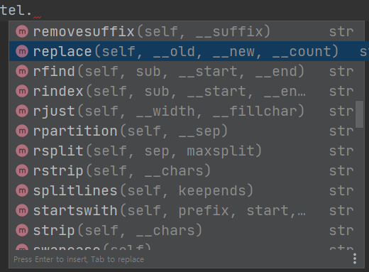
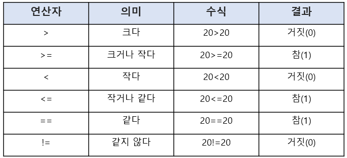

# 파이썬 Day 3


## 파이썬 실습


* offset 함수 : 몇 칸 건너뛸것인지, 양수(좌-->우), 음수(우-->좌)

  ```
  s='파이썬파이썬파이썬'
  print(s[::3])  #세 칸씩 건너뛴다
  
  # 파파파
  ```

  ```
  s='파이썬파이썬파이썬'
  print(s[::-1])           #dndptj whkfh
  
  # 썬이파썬이파썬이파
  ```

  

* replace (~을, ~으로) : 문자열 치환

  데이터 수집 --> 전처리 --> 분석 --> ...  으로 이어지는 분석과정에서 내가 원하는 정보를 가져올 때 사용

  

  ex)

  자연어 처리 시 텍스트 데이터 수집

  대한민국, 한국, korea, Korea, SouthKorea 모두 다른의미를 가지고 있기에 replace 함수를 사용하여 같은 단어로 변환

  

                       # ctrl + spacebar : 목록창 나옴

  ```
  tel="010-1234-5678"
  print(tel.replace("-", ""))            # "-"를 ""로 바꿔라
  
  # 01012345678
  ```

  

* 불 연산자 (Boolean operator)

  

```
print(3>2)
# True
```
```
print(2==2)
# True
```
```
print(3!=2)
# True
```

```
print('python'=='Python')
# False
```


