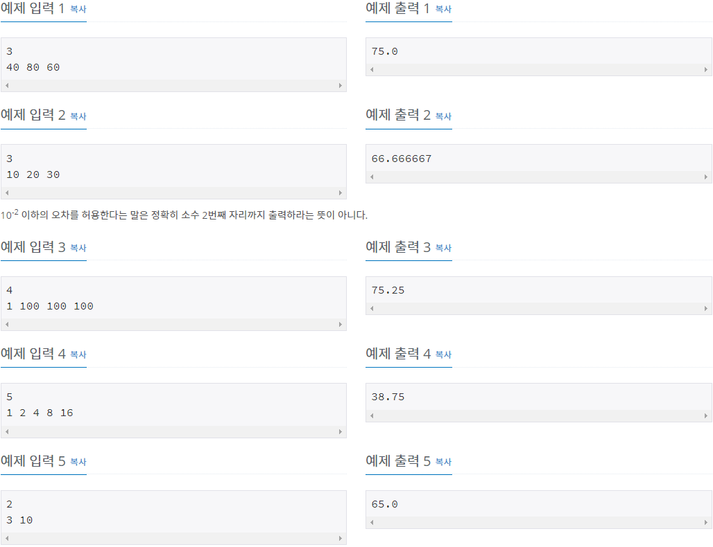
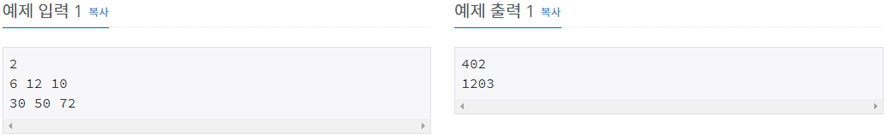

# [1000번](https://www.acmicpc.net/problem/1000)

## 문제

두 정수 A와 B를 입력받은 다음, A+B를 출력하는 프로그램을 작성하시오.

## 입력

첫째 줄에 A와 B가 주어진다. (0 < A, B < 10)

## 출력

첫째 줄에 A+B를 출력한다.


## 내 제출

```
a,b=map(int,input().split())
print(a+b)
```


# [1110번](https://www.acmicpc.net/problem/1110)

## 문제

0보다 크거나 같고, 99보다 작거나 같은 정수가 주어질 때 다음과 같은 연산을 할 수 있다. 먼저 주어진 수가 10보다 작다면 앞에 0을 붙여 두 자리 수로 만들고, 각 자리의 숫자를 더한다. 그 다음, 주어진 수의 가장 오른쪽 자리 수와 앞에서 구한 합의 가장 오른쪽 자리 수를 이어 붙이면 새로운 수를 만들 수 있다. 다음 예를 보자.

26부터 시작한다. 2+6 = 8이다. 새로운 수는 68이다. 6+8 = 14이다. 새로운 수는 84이다. 8+4 = 12이다. 새로운 수는 42이다. 4+2 = 6이다. 새로운 수는 26이다.

위의 예는 4번만에 원래 수로 돌아올 수 있다. 따라서 26의 사이클의 길이는 4이다.

N이 주어졌을 때, N의 사이클의 길이를 구하는 프로그램을 작성하시오.

## 입력

첫째 줄에 N이 주어진다. N은 0보다 크거나 같고, 99보다 작거나 같은 정수이다.

## 출력

첫째 줄에 N의 사이클 길이를 출력한다.


## 내 제출

```
N = int(input())

cur_num = N
repeated = 0

while True:
    repeated += 1
    cur_num = cur_num % 10 * 10 + sum(map(int, str(cur_num))) % 10
    if N == cur_num:
        print(repeated)
        break
```


# [1152번](https://www.acmicpc.net/problem/1152)

## 문제

영어 대소문자와 띄어쓰기만으로 이루어진 문자열이 주어진다. 이 문자열에는 몇 개의 단어가 있을까? 이를 구하는 프로그램을 작성하시오. 단, 한 단어가 여러 번 등장하면 등장한 횟수만큼 모두 세어야 한다.

## 입력

첫 줄에 영어 대소문자와 띄어쓰기로 이루어진 문자열이 주어진다. 이 문자열의 길이는 1,000,000을 넘지 않는다. 단어는 띄어쓰기 한 개로 구분되며, 공백이 연속해서 나오는 경우는 없다. 또한 문자열의 앞과 뒤에는 공백이 있을 수도 있다.

## 출력

첫째 줄에 단어의 개수를 출력한다.

## 

## 내 제출

```
import re
case=re.findall("[a-zA-Z]+",input())
print(len(case))
```


# [1316번](https://www.acmicpc.net/problem/1316)

## 문제

그룹 단어란 단어에 존재하는 모든 문자에 대해서, 각 문자가 연속해서 나타나는 경우만을 말한다. 예를 들면, ccazzzzbb는 c, a, z, b가 모두 연속해서 나타나고, kin도 k, i, n이 연속해서 나타나기 때문에 그룹 단어이지만, aabbbccb는 b가 떨어져서 나타나기 때문에 그룹 단어가 아니다.

단어 N개를 입력으로 받아 그룹 단어의 개수를 출력하는 프로그램을 작성하시오.

## 입력

첫째 줄에 단어의 개수 N이 들어온다. N은 100보다 작거나 같은 자연수이다. 둘째 줄부터 N개의 줄에 단어가 들어온다. 단어는 알파벳 소문자로만 되어있고 중복되지 않으며, 길이는 최대 100이다.

## 출력

첫째 줄에 그룹 단어의 개수를 출력한다.


## 내 제출

```
def connum(text):
    import re
    for i in list(set(text)):
        if len(re.findall("[{0}]+".format(i), text)) == 1:
            continue
        else:
            return False
    return True

a=int(input())
c=0
for x in range(a):
    text=input()
    if connum(text):
        c+=1
print(c)
```

## 다른 사람

```
result = 0
for i in range(int(input())):
    word = input()
    if list(word) == sorted(word, key=word.find):
        result += 1
print(result)
```


# [1546번](https://www.acmicpc.net/problem/1546)

## 문제

세준이는 기말고사를 망쳤다. 세준이는 점수를 조작해서 집에 가져가기로 했다. 일단 세준이는 자기 점수 중에 최댓값을 골랐다. 이 값을 M이라고 한다. 그리고 나서 모든 점수를 점수/M*100으로 고쳤다.

예를 들어, 세준이의 최고점이 70이고, 수학점수가 50이었으면 수학점수는 50/70*100이 되어 71.43점이 된다.

세준이의 성적을 위의 방법대로 새로 계산했을 때, 새로운 평균을 구하는 프로그램을 작성하시오.

## 입력

첫째 줄에 시험 본 과목의 개수 N이 주어진다. 이 값은 1000보다 작거나 같다. 둘째 줄에 세준이의 현재 성적이 주어진다. 이 값은 100보다 작거나 같은 음이 아닌 정수이고, 적어도 하나의 값은 0보다 크다.

## 출력

첫째 줄에 새로운 평균을 출력한다. 실제 정답과 출력값의 절대오차 또는 상대오차가 10-2 이하이면 정답이다.



## 내 제출

```
n=int(input())
l=list(map(int,input().split()))
m=max(l)
for i in range(n):
    l[i]=l[i]/m*100
print(sum(l)/n)
```

## 다른 사람

```
# 1546
n = int(input())
a=list(map(int,input().split()))
m = max(a)
for i in range(n):
    a[i] = a[i]/m*100
print(sum(a)/n)
```


# [2562번](https://www.acmicpc.net/problem/2562)

## 문제

9개의 서로 다른 자연수가 주어질 때, 이들 중 최댓값을 찾고 그 최댓값이 몇 번째 수인지를 구하는 프로그램을 작성하시오.

예를 들어, 서로 다른 9개의 자연수

3, 29, 38, 12, 57, 74, 40, 85, 61

이 주어지면, 이들 중 최댓값은 85이고, 이 값은 8번째 수이다.

## 입력

첫째 줄부터 아홉 번째 줄까지 한 줄에 하나의 자연수가 주어진다. 주어지는 자연수는 100 보다 작다.

## 출력

첫째 줄에 최댓값을 출력하고, 둘째 줄에 최댓값이 몇 번째 수인지를 출력한다.


## 내 제출

```
a=list()
for i in range(9):
    a.append((int(input())))
for i in range(9):
    if max(a)==a[i]:
        print(max(a))
        print(i+1)
```

## 다른 사람

```
l=[int(input())for i in range(9)]
print(max(l),l.index(max(l))+1)
```


# [2577번](https://www.acmicpc.net/problem/2577) 숫자의 개수

## 문제

세 개의 자연수 A, B, C가 주어질 때 A × B × C를 계산한 결과에 0부터 9까지 각각의 숫자가 몇 번씩 쓰였는지를 구하는 프로그램을 작성하시오.

예를 들어 A = 150, B = 266, C = 427 이라면 A × B × C = 150 × 266 × 427 = 17037300 이 되고, 계산한 결과 17037300 에는 0이 3번, 1이 1번, 3이 2번, 7이 2번 쓰였다.

## 입력

첫째 줄에 A, 둘째 줄에 B, 셋째 줄에 C가 주어진다. A, B, C는 모두 100보다 같거나 크고, 1,000보다 작은 자연수이다.

## 출력

첫째 줄에는 A × B × C의 결과에 0 이 몇 번 쓰였는지 출력한다. 마찬가지로 둘째 줄부터 열 번째 줄까지 A × B × C의 결과에 1부터 9까지의 숫자가 각각 몇 번 쓰였는지 차례로 한 줄에 하나씩 출력한다.


## 내 제출

```
a,b,c=[int(input())for i in range(3)]
d=list(str(a*b*c))
for i in range(10):
    print(d.count(str(i)))
```

## 다른사람

```
a = int(input())
b = int(input())
c = int(input())

d = list(map(int, (str(a * b * c))))

for i in range(10):
    print(d.count(i))
```


# [2669번](https://www.acmicpc.net/problem/2669) 직사각형 네개의 합집합의 면적 구하기

## 문제

평면에 네 개의 직사각형이 놓여 있는데 그 밑변은 모두 가로축에 평행하다. 이 네 개의 직사각형들은 서로 떨어져 있을 수도 있고, 겹쳐 있을 수도 있고, 하나가 다른 하나를 포함할 수도 있으며, 변이나 꼭짓점이 겹칠 수도 있다.

이 직사각형들이 차지하는 면적을 구하는 프로그램을 작성하시오.


## 입력

입력은 네 줄이며, 각 줄은 직사각형의 위치를 나타내는 네 개의 정수로 주어진다. 첫 번째와 두 번째의 정수는 사각형의 왼쪽 아래 꼭짓점의 x좌표, y좌표이고 세 번째와 네 번째의 정수는 사각형의 오른쪽 위 꼭짓점의 x좌표, y좌표이다. 모든 x좌표와 y좌표는 1이상이고 100이하인 정수이다.

## 출력

첫 줄에 네개의 직사각형이 차지하는 면적을 출력한다.


## 내 제출

```
area=set()
for i in range(4):
    sq=list(map(int, input().split()))
    for x in range(sq[0],sq[2]):
        for y in range(sq[1],sq[3]):
            area.add((x,y))
print(len(area))
```

## 다른 사람

```
r = [[0]*101 for _ in range(101)]
for _ in range(4):
	a, b, c, d = map(int, input().split())
	for i in range(a, c):
		for j in range(b, d):
			r[i][j] = 1
print(sum(sum(k) for k in r))
```


# [2675번](https://www.acmicpc.net/problem/2675) 문자열 반복

## 문제

문자열 S를 입력받은 후에, 각 문자를 R번 반복해 새 문자열 P를 만든 후 출력하는 프로그램을 작성하시오. 즉, 첫 번째 문자를 R번 반복하고, 두 번째 문자를 R번 반복하는 식으로 P를 만들면 된다. S에는 QR Code "alphanumeric" 문자만 들어있다.

QR Code "alphanumeric" 문자는 `0123456789ABCDEFGHIJKLMNOPQRSTUVWXYZ\$%*+-./:` 이다.

## 입력

첫째 줄에 테스트 케이스의 개수 T(1 ≤ T ≤ 1,000)가 주어진다. 각 테스트 케이스는 반복 횟수 R(1 ≤ R ≤ 8), 문자열 S가 공백으로 구분되어 주어진다. S의 길이는 적어도 1이며, 20글자를 넘지 않는다. 

## 출력

각 테스트 케이스에 대해 P를 출력한다.


## 내 제출

```
case=int(input())
for x in range(case):
    a,b=input().split()
    a=int(a)
    for i in b:
        print(i*a,end="")
    print()
```

## 다른 사람

```
t=int(input())
for i in range(t):
 a,b=input().split()
 for j in b:
  print(int(a)*j, end='')
 print()
```


# [2753번](https://www.acmicpc.net/problem/2753) 윤년

## 문제

연도가 주어졌을 때, 윤년이면 1, 아니면 0을 출력하는 프로그램을 작성하시오.

윤년은 연도가 4의 배수이면서, 100의 배수가 아닐 때 또는 400의 배수일 때이다.

예를 들어, 2012년은 4의 배수이면서 100의 배수가 아니라서 윤년이다. 1900년은 100의 배수이고 400의 배수는 아니기 때문에 윤년이 아니다. 하지만, 2000년은 400의 배수이기 때문에 윤년이다.

## 입력

첫째 줄에 연도가 주어진다. 연도는 1보다 크거나 같고, 4000보다 작거나 같은 자연수이다.

## 출력

첫째 줄에 윤년이면 1, 아니면 0을 출력한다.


## 내 제출

```
a=int(input())
if a%4==0 and a%100!=0 or a%400==0:
    print(1)
else:
    print(0)
```


# [2884](https://www.acmicpc.net/problem/2884)번 알람시계

## 문제

상근이는 매일 아침 알람을 듣고 일어난다. 알람을 듣고 바로 일어나면 다행이겠지만, 항상 조금만 더 자려는 마음 때문에 매일 학교를 지각하고 있다.

상근이는 모든 방법을 동원해보았지만, 조금만 더 자려는 마음은 그 어떤 것도 없앨 수가 없었다.

이런 상근이를 불쌍하게 보던, 창영이는 자신이 사용하는 방법을 추천해 주었다.

바로 "45분 일찍 알람 설정하기"이다.

이 방법은 단순하다. 원래 설정되어 있는 알람을 45분 앞서는 시간으로 바꾸는 것이다. 어차피 알람 소리를 들으면, 알람을 끄고 조금 더 잘 것이기 때문이다. 이 방법을 사용하면, 매일 아침 더 잤다는 기분을 느낄 수 있고, 학교도 지각하지 않게 된다.

현재 상근이가 설정한 알람 시각이 주어졌을 때, 창영이의 방법을 사용한다면, 이를 언제로 고쳐야 하는지 구하는 프로그램을 작성하시오.

## 입력

첫째 줄에 두 정수 H와 M이 주어진다. (0 ≤ H ≤ 23, 0 ≤ M ≤ 59) 그리고 이것은 현재 상근이가 설정한 놓은 알람 시간 H시 M분을 의미한다.

입력 시간은 24시간 표현을 사용한다. 24시간 표현에서 하루의 시작은 0:0(자정)이고, 끝은 23:59(다음날 자정 1분 전)이다. 시간을 나타낼 때, 불필요한 0은 사용하지 않는다.

## 출력

첫째 줄에 상근이가 창영이의 방법을 사용할 때, 설정해야 하는 알람 시간을 출력한다. (입력과 같은 형태로 출력하면 된다.)


## 내 제출

```
time_list=list(map(int,input().split()))
if time_list[1]>=45:
    print(time_list[0],time_list[1]-45)
elif time_list[0]==0 and time_list[1]<45:
    print(23,60+time_list[1]-45)
else:
    print(time_list[0] - 1, 60 + time_list[1] - 45)
```

## 다른 사람

```
a,b=map(int,input().split());x=a*60+b-45;print(x//60%24,x%60)
```

```
a,b=map(int,input().split())
c=(a*60+b-45)%1440
print(c//60,c%60)
```


# [2908번](https://www.acmicpc.net/problem/2908) 상수

## 문제

상근이의 동생 상수는 수학을 정말 못한다. 상수는 숫자를 읽는데 문제가 있다. 이렇게 수학을 못하는 상수를 위해서 상근이는 수의 크기를 비교하는 문제를 내주었다. 상근이는 세 자리 수 두 개를 칠판에 써주었다. 그 다음에 크기가 큰 수를 말해보라고 했다.

상수는 수를 다른 사람과 다르게 거꾸로 읽는다. 예를 들어, 734와 893을 칠판에 적었다면, 상수는 이 수를 437과 398로 읽는다. 따라서, 상수는 두 수중 큰 수인 437을 큰 수라고 말할 것이다.

두 수가 주어졌을 때, 상수의 대답을 출력하는 프로그램을 작성하시오.

## 입력

첫째 줄에 상근이가 칠판에 적은 두 수 A와 B가 주어진다. 두 수는 같지 않은 세 자리 수이며, 0이 포함되어 있지 않다.

## 출력

첫째 줄에 상수의 대답을 출력한다.


## 내 제출

```
a=input().split()[::-1]
a[0]=a[0][::-1]
a[1]=a[1][::-1]
a.sort(key=lambda x:x)
print(a[-1])
```

## 다른 사람

```
a, b =input().split()

def reading(k):
    k = k[::-1]
    return int(k)

print(max([reading(a),reading(b)]))
```

```
a, b = input().split()
a = a[::-1]
b = b[::-1]

print(max(a, b))
```


# [2941번](https://www.acmicpc.net/problem/2941) 크로아티아 알파벳

## 문제

예전에는 운영체제에서 크로아티아 알파벳을 입력할 수가 없었다. 따라서, 다음과 같이 크로아티아 알파벳을 변경해서 입력했다.

| 크로아티아 알파벳 | 변경 |
| :---------------- | :--- |
| č                 | c=   |
| ć                 | c-   |
| dž                | dz=  |
| đ                 | d-   |
| lj                | lj   |
| nj                | nj   |
| š                 | s=   |
| ž                 | z=   |

예를 들어, ljes=njak은 크로아티아 알파벳 6개(lj, e, š, nj, a, k)로 이루어져 있다. 단어가 주어졌을 때, 몇 개의 크로아티아 알파벳으로 이루어져 있는지 출력한다.

dž는 무조건 하나의 알파벳으로 쓰이고, d와 ž가 분리된 것으로 보지 않는다. lj와 nj도 마찬가지이다. 위 목록에 없는 알파벳은 한 글자씩 센다.

## 입력

첫째 줄에 최대 100글자의 단어가 주어진다. 알파벳 소문자와 '-', '='로만 이루어져 있다.

단어는 크로아티아 알파벳으로 이루어져 있다. 문제 설명의 표에 나와있는 알파벳은 변경된 형태로 입력된다.

## 출력

입력으로 주어진 단어가 몇 개의 크로아티아 알파벳으로 이루어져 있는지 출력한다.


## 내 제출

```
a=input()
b=["c=","c-","dz=","d-","lj","nj","s=","z="]
for i in b:
    if i in a:
        a=a.replace(i,"1")
print(len(a))
```


# [3052번](https://www.acmicpc.net/problem/3052) 나머지

## 문제

두 자연수 A와 B가 있을 때, A%B는 A를 B로 나눈 나머지 이다. 예를 들어, 7, 14, 27, 38을 3으로 나눈 나머지는 1, 2, 0, 2이다. 

수 10개를 입력받은 뒤, 이를 42로 나눈 나머지를 구한다. 그 다음 서로 다른 값이 몇 개 있는지 출력하는 프로그램을 작성하시오.

## 입력

첫째 줄부터 열번째 줄 까지 숫자가 한 줄에 하나씩 주어진다. 이 숫자는 1,000보다 작거나 같고, 음이 아닌 정수이다.

## 출력

첫째 줄에, 42로 나누었을 때, 서로 다른 나머지가 몇 개 있는지 출력한다.


## 내 제출

```
l=[int(input())for i in range(10)]
a=set()
for i in range(10):
    a.add(l[i]%42)
print(len(a))
```


# [4344번](https://www.acmicpc.net/problem/4344) 평균은 넘겠지

## 문제

대학생 새내기들의 90%는 자신이 반에서 평균은 넘는다고 생각한다. 당신은 그들에게 슬픈 진실을 알려줘야 한다.

## 입력

첫째 줄에는 테스트 케이스의 개수 C가 주어진다.

둘째 줄부터 각 테스트 케이스마다 학생의 수 N(1 ≤ N ≤ 1000, N은 정수)이 첫 수로 주어지고, 이어서 N명의 점수가 주어진다. 점수는 0보다 크거나 같고, 100보다 작거나 같은 정수이다.

## 출력

각 케이스마다 한 줄씩 평균을 넘는 학생들의 비율을 반올림하여 소수점 셋째 자리까지 출력한다.


## 내 제출

```
case=int(input())

for i in range(case):
    numlist=list(map(int,input().split()))
    average=sum(numlist[1:]) / numlist[0]
    above=0
    
    for j in range(1,len(numlist)):
        if numlist[j]>average:
            above+=1
            
    print("%.3f"%(above/numlist[0]*100),"%",sep="")
```

## 다른 사람

```
import sys
input = sys.stdin.readline

test_case = int(input())

for _ in range(test_case):
    data = input().strip().split(' ')
    scores = list(map(float, data[1:]))
    average = sum(scores) / len(scores)

    above = 0
    for score in scores:
        if score > average:
            above += 1

    print(f'{(above/len(scores))*100:.3f}%')
```

```
import sys
n = int(sys.stdin.readline())
for i in range(n):
	l = list(map(int, sys.stdin.readline().split()))
	cnt = l[0]
	scores = l[1:]
	avg = sum(scores) / len(scores)
	j = 0
	for score in scores:
		if score > avg: j = j + 1
	print(format(j / cnt, "2.3%"))
```

```
import sys
s=sys.stdin.readline
for i in range(int(s())):
    a=list(map(int,s().split()))
    b=sum(a[1:])/a[0]
    print("%.03f"%(len([x for x in a[1:] if x>b])/a[0]*100)+'%')
```


# [5622번](https://www.acmicpc.net/problem/5622) 다이얼

## 문제

상근이의 할머니는 아래 그림과 같이 오래된 다이얼 전화기를 사용한다.


전화를 걸고 싶은 번호가 있다면, 숫자를 하나를 누른 다음에 금속 핀이 있는 곳 까지 시계방향으로 돌려야 한다. 숫자를 하나 누르면 다이얼이 처음 위치로 돌아가고, 다음 숫자를 누르려면 다이얼을 처음 위치에서 다시 돌려야 한다.

숫자 1을 걸려면 총 2초가 필요하다. 1보다 큰 수를 거는데 걸리는 시간은 이보다 더 걸리며, 한 칸 옆에 있는 숫자를 걸기 위해선 1초씩 더 걸린다.

상근이의 할머니는 전화 번호를 각 숫자에 해당하는 문자로 외운다. 즉, 어떤 단어를 걸 때, 각 알파벳에 해당하는 숫자를 걸면 된다. 예를 들어, UNUCIC는 868242와 같다.

할머니가 외운 단어가 주어졌을 때, 이 전화를 걸기 위해서 필요한 최소 시간을 구하는 프로그램을 작성하시오.

## 입력

첫째 줄에 알파벳 대문자로 이루어진 단어가 주어진다. 단어의 길이는 2보다 크거나 같고, 15보다 작거나 같다.

## 출력

첫째 줄에 다이얼을 걸기 위해서 필요한 최소 시간을 출력한다.


## 내 제출

```
a=list(input())
for i in range(len(a)):
    if a[i]=="A" or a[i]=="B" or a[i]=="C":
        a[i]= 3
    elif a[i]=="D" or a[i]=="E" or a[i]=="F":
        a[i] = 4
    elif a[i] == "G" or a[i] == "H" or a[i] == "I":
        a[i] = 5
    elif a[i] == "J" or a[i] == "K" or a[i] == "L":
        a[i] = 6
    elif a[i] == "M" or a[i] == "N" or a[i] == "O":
        a[i] = 7
    elif a[i] == "P" or a[i] == "Q" or a[i] == "R" or a[i] == "S":
        a[i] = 8
    elif a[i] == "T" or a[i] == "U" or a[i] == "V":
        a[i] = 9
    elif a[i] == "W" or a[i] == "X" or a[i] == "Y" or a[i] == "Z":
        a[i] = 10
print(sum(a))
```

## 다른 사람

```
li=['ABC','DEF','GHI','JKL','MNO','PQRS','TUV','WXYZ']
word=input()
cnt=0
for i in range(len(word)):
    for j in li:
        if word[i] in j:
            cnt+=li.index(j)+3
print(cnt)
```


# [8958번](https://www.acmicpc.net/problem/8958) OX퀴즈

| 시간 제한 | 메모리 제한 | 제출  | 정답  | 맞은 사람 | 정답 비율 |
| :-------- | :---------- | :---- | :---- | :-------- | :-------- |
| 1 초      | 128 MB      | 73324 | 36983 | 31684     | 51.642%   |

## 문제

"OOXXOXXOOO"와 같은 OX퀴즈의 결과가 있다. O는 문제를 맞은 것이고, X는 문제를 틀린 것이다. 문제를 맞은 경우 그 문제의 점수는 그 문제까지 연속된 O의 개수가 된다. 예를 들어, 10번 문제의 점수는 3이 된다.

"OOXXOXXOOO"의 점수는 1+2+0+0+1+0+0+1+2+3 = 10점이다.

OX퀴즈의 결과가 주어졌을 때, 점수를 구하는 프로그램을 작성하시오.

## 입력

첫째 줄에 테스트 케이스의 개수가 주어진다. 각 테스트 케이스는 한 줄로 이루어져 있고, 길이가 0보다 크고 80보다 작은 문자열이 주어진다. 문자열은 O와 X만으로 이루어져 있다.

## 출력

각 테스트 케이스마다 점수를 출력한다.


## 내 제출

```
n=int(input())
for i in range(n):
    a=input()
    b=0
    c=0
    for j in range(len(a)):
        if a[j]=="O":
            b=b+1
            c+=b
        else:
            b=0
    print(c)
```

## 다른 사람

```
import sys
N = int(sys.stdin.readline())
for i in range(N):
    quiz_result = sys.stdin.readline()
    accum = 1
    score = 0
    for q in quiz_result:
        if q is 'O':
            score += accum
            accum += 1
        else:
            accum = 1
    print(score)
```

```
from sys import stdin
for _ in range(int(stdin.readline())):
    print(sum(sum(range(1,len(i)+1)) for i in stdin.readline().strip().split(sep='X')))
```


# [10809번](https://www.acmicpc.net/problem/10809) 알파벳찾기

## 문제

알파벳 소문자로만 이루어진 단어 S가 주어진다. 각각의 알파벳에 대해서, 단어에 포함되어 있는 경우에는 처음 등장하는 위치를, 포함되어 있지 않은 경우에는 -1을 출력하는 프로그램을 작성하시오.

## 입력

첫째 줄에 단어 S가 주어진다. 단어의 길이는 100을 넘지 않으며, 알파벳 소문자로만 이루어져 있다.

## 출력

각각의 알파벳에 대해서, a가 처음 등장하는 위치, b가 처음 등장하는 위치, ... z가 처음 등장하는 위치를 공백으로 구분해서 출력한다.

만약, 어떤 알파벳이 단어에 포함되어 있지 않다면 -1을 출력한다. 단어의 첫 번째 글자는 0번째 위치이고, 두 번째 글자는 1번째 위치이다.


## 내 제출

```
S=input()
for i in list(map(chr,range(97,123))):
    print(S.find(i),end=" ")
```


# [11654번](https://www.acmicpc.net/problem/11654) 아스키 코드

## 문제

알파벳 소문자, 대문자, 숫자 0-9중 하나가 주어졌을 때, 주어진 글자의 아스키 코드값을 출력하는 프로그램을 작성하시오.

## 입력

알파벳 소문자, 대문자, 숫자 0-9 중 하나가 첫째 줄에 주어진다.

## 출력

입력으로 주어진 글자의 아스키 코드 값을 출력한다.


## 내 제출

```
a = input()
print(ord(a))
```


# [14681번](https://www.acmicpc.net/problem/14681) 사분면 고르기

## 문제

흔한 수학 문제 중 하나는 주어진 점이 어느 사분면에 속하는지 알아내는 것이다. 사분면은 아래 그림처럼 1부터 4까지 번호를 갖는다. "Quadrant n"은 "제n사분면"이라는 뜻이다.


예를 들어, 좌표가 (12, 5)인 점 A는 x좌표와 y좌표가 모두 양수이므로 제1사분면에 속한다. 점 B는 x좌표가 음수이고 y좌표가 양수이므로 제2사분면에 속한다.

점의 좌표를 입력받아 그 점이 어느 사분면에 속하는지 알아내는 프로그램을 작성하시오. 단, x좌표와 y좌표는 모두 양수나 음수라고 가정한다.

## 입력

첫 줄에는 정수 x가 주어진다. (−1000 ≤ x ≤ 1000; x ≠ 0) 다음 줄에는 정수 y가 주어진다. (−1000 ≤ y ≤ 1000; y ≠ 0)

## 출력

점 (x, y)의 사분면 번호(1, 2, 3, 4 중 하나)를 출력한다.


## 내 제출

```
xpoint=int(input())
ypoint=int(input())
if xpoint>0 and ypoint>0:
    print("1")
elif xpoint<0 and ypoint>0:
    print("2")
elif xpoint<0 and ypoint<0:
    print("3")
else:
    print("4")
```

## 다른 사람

```
a = int(input())
b = int(input())
if a > 0:
    print(1 if b > 0 else 4)
elif a < 0:
    print(2 if b > 0 else 3)
```


# [1712번](https://www.acmicpc.net/problem/1712) 손익분기점

## 문제

월드전자는 노트북을 제조하고 판매하는 회사이다. 노트북 판매 대수에 상관없이 매년 임대료, 재산세, 보험료, 급여 등 A만원의 고정 비용이 들며, 한 대의 노트북을 생산하는 데에는 재료비와 인건비 등 총 B만원의 가변 비용이 든다고 한다.

예를 들어 A=1,000, B=70이라고 하자. 이 경우 노트북을 한 대 생산하는 데는 총 1,070만원이 들며, 열 대 생산하는 데는 총 1,700만원이 든다.

노트북 가격이 C만원으로 책정되었다고 한다. 일반적으로 생산 대수를 늘려 가다 보면 어느 순간 총 수입(판매비용)이 총 비용(=고정비용+가변비용)보다 많아지게 된다. 최초로 총 수입이 총 비용보다 많아져 이익이 발생하는 지점을 손익분기점(BREAK-EVEN POINT)이라고 한다.

A, B, C가 주어졌을 때, 손익분기점을 구하는 프로그램을 작성하시오.

## 입력

첫째 줄에 A, B, C가 빈 칸을 사이에 두고 순서대로 주어진다. A, B, C는 21억 이하의 자연수이다.

## 출력

첫 번째 줄에 손익분기점 즉 최초로 이익이 발생하는 판매량을 출력한다. 손익분기점이 존재하지 않으면 -1을 출력한다.


## 내 제출

```
a,b,c=map(int,input().split())
d=c-b
if d<=0:
    print(-1)
else:
    print((a//d)+1)
```


# [2292번](https://www.acmicpc.net/problem/2292) 벌집

## 문제

.png)

위의 그림과 같이 육각형으로 이루어진 벌집이 있다. 그림에서 보는 바와 같이 중앙의 방 1부터 시작해서 이웃하는 방에 돌아가면서 1씩 증가하는 번호를 주소로 매길 수 있다. 숫자 N이 주어졌을 때, 벌집의 중앙 1에서 N번 방까지 최소 개수의 방을 지나서 갈 때 몇 개의 방을 지나가는지(시작과 끝을 포함하여)를 계산하는 프로그램을 작성하시오. 예를 들면, 13까지는 3개, 58까지는 5개를 지난다.

## 입력

첫째 줄에 N(1 ≤ N ≤ 1,000,000,000)이 주어진다.

## 출력

입력으로 주어진 방까지 최소 개수의 방을 지나서 갈 때 몇 개의 방을 지나는지 출력한다.


# 내 제출

```
def honey():
    import math
    a=int(input())
    a=a-1.9
    d=math.ceil(a/6)
    b=0
    c=0
    while c<d:
        b += 1
        c += b
    print(b+1)
honey()
```


# [2869번](https://www.acmicpc.net/problem/2869) 달팽이는 올라가고 싶어

## 문제(for 컴프리헨션)

땅 위에 달팽이가 있다. 이 달팽이는 높이가 V미터인 나무 막대를 올라갈 것이다.

달팽이는 낮에 A미터 올라갈 수 있다. 하지만, 밤에 잠을 자는 동안 B미터 미끄러진다. 또, 정상에 올라간 후에는 미끄러지지 않는다.

달팽이가 나무 막대를 모두 올라가려면, 며칠이 걸리는지 구하는 프로그램을 작성하시오.

## 입력

첫째 줄에 세 정수 A, B, V가 공백으로 구분되어서 주어진다. (1 ≤ B < A ≤ V ≤ 1,000,000,000)

## 출력

첫째 줄에 달팽이가 나무 막대를 모두 올라가는데 며칠이 걸리는지 출력한다.


## 내 제출

```
import math
a,b,c=map(int,input().split())
d=math.ceil((c-b)/(a-b))
print(d)
```


# [10250번](https://www.acmicpc.net/problem/10250) ACM 호텔

## 문제

ACM 호텔 매니저 지우는 손님이 도착하는 대로 빈 방을 배정하고 있다. 고객 설문조사에 따르면 손님들은 호텔 정문으로부터 걸어서 가장 짧은 거리에 있는 방을 선호한다고 한다. 여러분은 지우를 도와 줄 프로그램을 작성하고자 한다. 즉 설문조사 결과 대로 호텔 정문으로부터 걷는 거리가 가장 짧도록 방을 배정하는 프로그램을 작성하고자 한다.

문제를 단순화하기 위해서 호텔은 직사각형 모양이라고 가정하자. 각 층에 W 개의 방이 있는 H 층 건물이라고 가정하자 (1 ≤ H, W ≤ 99). 그리고 엘리베이터는 가장 왼쪽에 있다고 가정하자(그림 1 참고). 이런 형태의 호텔을 H × W 형태 호텔이라고 부른다. 호텔 정문은 일층 엘리베이터 바로 앞에 있는데, 정문에서 엘리베이터까지의 거리는 무시한다. 또 모든 인접한 두 방 사이의 거리는 같은 거리(거리 1)라고 가정하고 호텔의 정면 쪽에만 방이 있다고 가정한다.


그림 1. H = 6 이고 W = 12 인 H × W 호텔을 간략하게 나타낸 그림

방 번호는 YXX 나 YYXX 형태인데 여기서 Y 나 YY 는 층 수를 나타내고 XX 는 엘리베이터에서부터 세었을 때의 번호를 나타낸다. 즉, 그림 1 에서 빗금으로 표시한 방은 305 호가 된다.

손님은 엘리베이터를 타고 이동하는 거리는 신경 쓰지 않는다. 다만 걷는 거리가 같을 때에는 아래층의 방을 더 선호한다. 예를 들면 102 호 방보다는 301 호 방을 더 선호하는데, 102 호는 거리 2 만큼 걸어야 하지만 301 호는 거리 1 만큼만 걸으면 되기 때문이다. 같은 이유로 102 호보다 2101 호를 더 선호한다.

여러분이 작성할 프로그램은 초기에 모든 방이 비어있다고 가정하에 이 정책에 따라 N 번째로 도착한 손님에게 배정될 방 번호를 계산하는 프로그램이다. 첫 번째 손님은 101 호, 두 번째 손님은 201 호 등과 같이 배정한다. 그림 1 의 경우를 예로 들면, H = 6이므로 10 번째 손님은 402 호에 배정해야 한다.

## 입력

프로그램은 표준 입력에서 입력 데이터를 받는다. 프로그램의 입력은 T 개의 테스트 데이터로 이루어져 있는데 T 는 입력의 맨 첫 줄에 주어진다. 각 테스트 데이터는 한 행으로서 H, W, N, 세 정수를 포함하고 있으며 각각 호텔의 층 수, 각 층의 방 수, 몇 번째 손님인지를 나타낸다(1 ≤ H, W ≤ 99, 1 ≤ N ≤ H × W). 

## 출력

프로그램은 표준 출력에 출력한다. 각 테스트 데이터마다 정확히 한 행을 출력하는데, 내용은 N 번째 손님에게 배정되어야 하는 방 번호를 출력한다.



## 내 제출

```
n=int(input())
for i in range(n):
    a,b,c=map(int,input().split())
    z=divmod(c,a)
    if z[1]==0:
        print(a*100+z[0])
    else:
        print(((z[1]) * 100) + (z[0] + 1))
```


```
import sys
T = int(sys.stdin.readline())
for _ in range(T):
    h, w, n = map(int, sys.stdin.readline().split())
    print("%d%02d" % ((n-1)%h+1, (n-1)//h+1))
```


# [2775번](https://www.acmicpc.net/problem/2775) 부녀회장이 될테야

## 문제

평소 반상회에 참석하는 것을 좋아하는 주희는 이번 기회에 부녀회장이 되고 싶어 각 층의 사람들을 불러 모아 반상회를 주최하려고 한다.

이 아파트에 거주를 하려면 조건이 있는데, “a층의 b호에 살려면 자신의 아래(a-1)층의 1호부터 b호까지 사람들의 수의 합만큼 사람들을 데려와 살아야 한다” 는 계약 조항을 꼭 지키고 들어와야 한다.

아파트에 비어있는 집은 없고 모든 거주민들이 이 계약 조건을 지키고 왔다고 가정했을 때, 주어지는 양의 정수 k와 n에 대해 k층에 n호에는 몇 명이 살고 있는지 출력하라. 단, 아파트에는 0층부터 있고 각층에는 1호부터 있으며, 0층의 i호에는 i명이 산다.

## 입력

첫 번째 줄에 Test case의 수 T가 주어진다. 그리고 각각의 케이스마다 입력으로 첫 번째 줄에 정수 k, 두 번째 줄에 정수 n이 주어진다

## 출력

각각의 Test case에 대해서 해당 집에 거주민 수를 출력하라.

## 제한

- 1 ≤ k, n ≤ 14


## 내 제출

```
lst = [[0 for j in range(14)] for i in range(15)]
for i in range(15):
    lst[i][0] = 1
for h in range(14):
    lst[0][h] = h+1
for i in range(1,15):
    for j in range(1,14):
        lst[i][j] = lst[i][j - 1] + lst[i - 1][j]

Test_case = int(input())
for i in range(Test_case):
    k = int(input())
    n = int(input())
    print(lst[k][n-1])
```


#  [1011번](https://www.acmicpc.net/problem/1011) Fly me to the Alpha Centauri

## 문제

우현이는 어린 시절, 지구 외의 다른 행성에서도 인류들이 살아갈 수 있는 미래가 오리라 믿었다. 그리고 그가 지구라는 세상에 발을 내려 놓은 지 23년이 지난 지금, 세계 최연소 ASNA 우주 비행사가 되어 새로운 세계에 발을 내려 놓는 영광의 순간을 기다리고 있다.

그가 탑승하게 될 우주선은 Alpha Centauri라는 새로운 인류의 보금자리를 개척하기 위한 대규모 생활 유지 시스템을 탑재하고 있기 때문에, 그 크기와 질량이 엄청난 이유로 최신기술력을 총 동원하여 개발한 공간이동 장치를 탑재하였다. 하지만 이 공간이동 장치는 이동 거리를 급격하게 늘릴 경우 기계에 심각한 결함이 발생하는 단점이 있어서, 이전 작동시기에 k광년을 이동하였을 때는 k-1 , k 혹은 k+1 광년만을 다시 이동할 수 있다. 예를 들어, 이 장치를 처음 작동시킬 경우 -1 , 0 , 1 광년을 이론상 이동할 수 있으나 사실상 음수 혹은 0 거리만큼의 이동은 의미가 없으므로 1 광년을 이동할 수 있으며, 그 다음에는 0 , 1 , 2 광년을 이동할 수 있는 것이다. ( 여기서 다시 2광년을 이동한다면 다음 시기엔 1, 2, 3 광년을 이동할 수 있다. )


김우현은 공간이동 장치 작동시의 에너지 소모가 크다는 점을 잘 알고 있기 때문에 x지점에서 y지점을 향해 최소한의 작동 횟수로 이동하려 한다. 하지만 y지점에 도착해서도 공간 이동장치의 안전성을 위하여 y지점에 도착하기 바로 직전의 이동거리는 반드시 1광년으로 하려 한다.

김우현을 위해 x지점부터 정확히 y지점으로 이동하는데 필요한 공간 이동 장치 작동 횟수의 최솟값을 구하는 프로그램을 작성하라.

## 입력

입력의 첫 줄에는 테스트케이스의 개수 T가 주어진다. 각각의 테스트 케이스에 대해 현재 위치 x 와 목표 위치 y 가 정수로 주어지며, x는 항상 y보다 작은 값을 갖는다. (0 ≤ x < y < 231)

## 출력

각 테스트 케이스에 대해 x지점으로부터 y지점까지 정확히 도달하는데 필요한 최소한의 공간이동 장치 작동 횟수를 출력한다.

